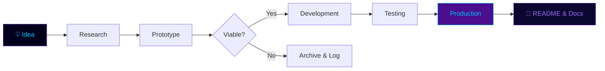

<!-- PAI — Personal Artificial Intelligence | Central AI Laboratory -->

<div align="center">


<br/>

[](#)
[](#)
[](#)
[](#)

<br/>


> *"Your tagline / quote here."*


</div>

---

##  Repository

```yaml
name:        PAI — Personal Artificial Intelligence
type:        AI Laboratory · Umbrella Repository
maintainer:  YOUR_NAME
scope:       All AI projects, experiments, research, and prototypes
founded:     YEAR
status:      Active · Continuously Expanding

domains:
  - Agentic AI & Multi-Agent Systems
  - LLM Fine-tuning & RAG Pipelines
  - Computer Vision
  - NLP & Text Intelligence
  - AI Utilities & Infrastructure
  - Research Implementations

portfolio:   LINK
company:     LINK
```

<div align="center">

</div>

---

## 🔭 Vision & Mission

<div align="center">

| 🔭 Vision | 🎯 Mission |
|:----------|:----------|
| [One sentence describing the long-term ambition of the lab — the kind of AI engineer/organization this repo represents.] | [One sentence describing what this repo is actively doing — building, experimenting, documenting.] |

</div>

<div align="center">

</div>

---

## 📁 Repository Architecture

> NOTE: Replace broken `user-images.githubusercontent.com` GIF links with capsule-render dividers (as used above) — they are reliable, animated, and GitHub-compatible.

```
PAI/
├── Project-Folder-1/          →  One-line description of project's nature
├── Project-Folder-2/          →  One-line description of project's nature
├── Project-Folder-3/          →  One-line description of project's nature
└── README.md
```

> Each subdirectory is a standalone project with its own `README.md`, dependencies, and documentation.

<div align="center">

</div>

---

## 🧠 AI Domains Covered

<div align="center">

<br/>


<br/>

</div>

<div align="center">

</div>

---

##  Current AI Projects

<div align="center">

| Project | Domain | Status | Stack | Progress | Docs |
|:--------|:-------|:-------|:------|:---------|:-----|
| [**PROJECT_NAME**](LINK) | `Nature of project (e.g. Computer Vision prototype)` |  | `Tech1` `Tech2` | `██████████ 100%` | [📄](LINK) |
| [**PROJECT_NAME**](LINK) | `Nature of project` |  | `Tech1` `Tech2` | `████████░░  80%` | [📄](LINK) |

</div>

> Add a new row per project. No restructuring needed as the list grows — for 20+ projects, split into collapsible `<details>` blocks per category (see "AI Project Categories" below).

<div align="center">

</div>

---

## 🗓️ Upcoming AI Projects

<div align="center">

| Project | Domain | Stack | ETA |
|:--------|:-------|:------|:----|
| **PROJECT_NAME** | `Nature of project` | `Tech1` `Tech2` | QX 20XX |

</div>

<div align="center">

</div>

---

## 🤖 Agentic AI Roadmap

<div align="center">

| Phase | Goal | Status |
|:------|:-----|:-------|
| Phase 1 | [Roadmap goal] |  |
| Phase 2 | [Roadmap goal] |  |
| Phase 3 | [Roadmap goal] |  |
| Phase 4 | [Roadmap goal] |  |

</div>

<div align="center">

</div>

---

## 🔬 Research & Experimentation Zone

<details>
<summary><b>📄 Paper Implementations</b></summary>
<br>

| Paper | Domain | Year | Status |
|:------|:-------|:-----|:-------|
| — | — | — | — |

</details>

<details>
<summary><b>⚗️ Active Experiments</b></summary>
<br>

| Experiment | Domain | Hypothesis | Status |
|:-----------|:-------|:-----------|:-------|
| — | — | — | — |

</details>

<details>
<summary><b>📦 Archived Experiments</b></summary>
<br>

| Experiment | Outcome | Learnings |
|:-----------|:--------|:----------|
| — | — | — |

</details>

> Use `<details>` collapsibles for every research category — keeps the README short at any scale (5, 20, or 50+ entries).

<div align="center">

</div>

---

##  AI Technology Stack

<div align="center">


<br/><br/>


<br/>

<a href="https://skillicons.dev"></a>

<br/><br/>


<br/>


<br/><br/>


<br/>

<a href="https://skillicons.dev"></a>

<br/><br/>


<br/>

<a href="https://skillicons.dev"></a>


</div>

<div align="center">

</div>

---

## 📅 Learning Journey Timeline

<div align="center">

| Period | Milestone | Technologies |
|:-------|:----------|:-------------|
| 20XX QX | [Milestone description] | `Tech1` `Tech2` |
| 20XX QX | [Milestone description] | `Tech1` `Tech2` |

</div>

<div align="center">

</div>

---

##  Featured Flagship Projects

<div align="center">

### [PROJECT_NAME](LINK)


| Attribute | Detail |
|:----------|:-------|
| **Type** | `Prototype` / `Research` / `Production` |
| **Domain** | [Nature of project, e.g. "AI-driven document intelligence"] |
| **Stack** | `Tech1` · `Tech2` · `Tech3` |
| **Progress** | `██████████ 100%` |
| **Docs** | [View README →](LINK) |

---

### [PROJECT_NAME](LINK)


| Attribute | Detail |
|:----------|:-------|
| **Type** | `Prototype` / `Research` / `Production` |
| **Domain** | [Nature of project] |
| **Stack** | `Tech1` · `Tech2` · `Tech3` |
| **Progress** | `████░░░░░░  40%` |
| **Docs** | [View README →](LINK) |

</div>

<div align="center">

</div>

---

## 🗂️ AI Project Categories

<div align="center">

| Category | Projects | Sub-domains |
|:---------|:---------|:------------|
| Computer Vision | N | [sub-domain examples] |
| Agentic AI | N | [sub-domain examples] |
| RAG Systems | N | [sub-domain examples] |
| LLM Engineering | N | [sub-domain examples] |
| NLP | N | [sub-domain examples] |
| AI Utilities | N | [sub-domain examples] |
| Research | N | [sub-domain examples] |

</div>

> At scale (20+ projects), convert each row into a collapsible `<details>` section listing individual projects within that category, to keep the top-level table compact.

<div align="center">

</div>

---

##  Repository Statistics

<div align="center">

<table>
  <tr>
    <td>
      
    </td>
    <td>
      
    </td>
  </tr>
  <tr>
    <td colspan="2" align="center">
      
    </td>
  </tr>
  <tr>
    <td colspan="2" align="center">
      
    </td>
  </tr>
</table>

</div>

<div align="center">

</div>

---

## ⚙️ Development Workflow



<div align="center">

</div>

---

## 🚀 Future Expansion Plans

<details>
<summary><b>🤖 Agentic Infrastructure</b></summary>
<br>

- [Plan item]
- [Plan item]
- [Plan item]

</details>

<details>
<summary><b>🧠 LLM Fine-tuning Lab</b></summary>
<br>

- [Plan item]
- [Plan item]

</details>

<details>
<summary><b>🔗 RAG Infrastructure</b></summary>
<br>

- [Plan item]
- [Plan item]

</details>

<details>
<summary><b>👁️ Computer Vision Expansion</b></summary>
<br>

- [Plan item]
- [Plan item]

</details>

<div align="center">

</div>

---

## 🤝 Contribution Guidelines

PAI is a personal laboratory. External contributions are welcome for research implementations and bug fixes.

1. Fork the repository
2. Create a branch: `git checkout -b feature/your-feature`
3. Follow existing project structure — each project in its own subdirectory with a `README.md`
4. Open a Pull Request with a clear description

<div align="center">

</div>

---

##  Contact & Links

<div align="center">

[](#)
[](#)
[](#)
[](#)
[](#)
[](#)

<br/>


<br/>

**[Portfolio Link]** &nbsp;·&nbsp; **[Email]** &nbsp;·&nbsp; **[Company/Site Link]**

</div>