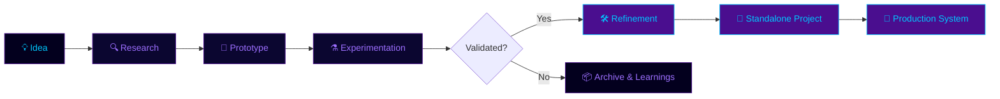

<div align="center">


<br/>


</div>

---

## 🧭 What is PAI?

**PAI (Programming for AI)** is a long-term, multi-domain AI research and development laboratory. It is not a single project — it is an **ecosystem repository** that houses every AI prototype, experiment, research implementation, utility, and production system built over time.

PAI exists as a **single source of truth** for an evolving body of AI work: a place where ideas are tested quickly, promising ones are pushed further, and the strongest survive as standalone systems. Every subdirectory inside PAI represents a project at some stage of this lifecycle — from a rough proof of concept to a fully operational system.

This README is the **landing page of the laboratory**. It does not describe individual projects in detail (those live in their own subdirectories with their own documentation). Instead, it describes the **structure, philosophy, and direction** of the lab itself — so it remains accurate and useful no matter how many projects come and go.

<div align="center">

</div>

---

## 🔭 Why PAI Exists

Modern AI engineering spans an enormous range of disciplines — agentic systems, retrieval-augmented generation, fine-tuning, computer vision, natural language processing, multi-agent orchestration, and infrastructure that ties it all together. Working on these in isolated, disconnected repositories makes it difficult to track progress, reuse components, or see the bigger picture.

PAI solves this by acting as a **centralized laboratory**:

- A consistent place to start new AI experiments without setup overhead
- A shared knowledge base of what has been tried, what worked, and what didn't
- A foundation of reusable utilities, patterns, and infrastructure across projects
- A visible record of skill growth and research direction over time
- A pipeline for turning small prototypes into serious, standalone systems

<div align="center">

</div>

---

## ♻️ The PAI Development Model

Every project inside PAI — regardless of domain — follows the same lifecycle. This lifecycle is the core philosophy of the lab: nothing is built fully-formed. Everything starts small, is tested under real conditions, and earns its way into something larger.



<div align="center">

| Stage | What Happens Here |
|:------|:-------------------|
| 💡 **Idea** | A concept worth exploring is identified — a problem, a paper, a workflow gap, or a curiosity. |
| 🔍 **Research** | Background reading, prior-art review, and feasibility assessment before any code is written. |
| 🧪 **Prototype** | A minimal, working version is built inside PAI to test the core concept end-to-end. |
| ⚗️ **Experimentation** | The prototype is stress-tested with different approaches, data, and configurations. |
| ✅ **Validation** | The idea is judged on whether it actually works well enough to justify further investment. |
| 🛠️ **Refinement** | Validated work is cleaned up, restructured, and made more robust and maintainable. |
| 📂 **Standalone Project** | The refined work graduates into its own dedicated directory with full documentation. |
| 🚀 **Production System** | The project reaches a stable, deployable, and maintained state. |

</div>

<div align="center">

</div>

---

## 🏗️ Repository Organization

PAI is structured as a flat collection of project directories, each representing one unit of work at any stage of the development model above. There is no fixed slot count or numbering — directories are added, promoted, or archived as work progresses.

```
PAI/
├── <project-directory>/   →  Independent project, own README & dependencies
├── <project-directory>/   →  Independent project, own README & dependencies
├── <project-directory>/   →  Independent project, own README & dependencies
└── README.md               →  This file — laboratory overview & philosophy
```

**Organizational rules that keep this scalable:**

- Every project directory is **self-contained** — its own README, dependencies, and docs
- This top-level README **never lists individual projects** — it describes domains and direction, which remain stable
- A project's **stage** (prototype, experiment, standalone, production) is documented inside that project's own README, not here
- Archived or deprecated projects are moved to an `archive/` directory rather than deleted, preserving the learning record

<div align="center">

</div>

---

## 🧠 Active Domains

These are the core areas of AI engineering that PAI focuses on. Work in any of these domains can exist at any lifecycle stage simultaneously — a domain might have a production system, an active experiment, and a brand-new prototype all at once.

<div align="center">


</div>

<details>
<summary><b>🤖 Agentic AI & Multi-Agent Systems</b></summary>
<br>

Systems where AI models act with autonomy — using tools, making decisions, planning multi-step tasks, and coordinating with other agents to accomplish goals. This domain progresses from single-agent tool-use patterns toward orchestrated, stateful multi-agent pipelines with memory and planning.

</details>

<details>
<summary><b>🔗 RAG Systems</b></summary>
<br>

Retrieval-augmented architectures that connect language models to external knowledge — document search, semantic retrieval, embeddings, and hybrid search pipelines. Work here ranges from simple document Q&A prototypes to production-grade knowledge retrieval APIs.

</details>

<details>
<summary><b>🧠 LLM Engineering & Fine-tuning</b></summary>
<br>

Everything related to working directly with large language models — inference pipelines, prompt and evaluation frameworks, and fine-tuning models for specific tasks or domains using techniques like LoRA and PEFT.

</details>

<details>
<summary><b>👁️ Computer Vision</b></summary>
<br>

Image and video understanding systems — detection, classification, segmentation, and domain-specific imaging applications. This domain spans research prototypes through to deployed, real-time vision systems.

</details>

<details>
<summary><b>📝 NLP & Text Intelligence</b></summary>
<br>

Text-focused AI systems covering sentiment analysis, named entity recognition, summarization, and other language-understanding tasks that operate independently of large-scale generative models.

</details>

<details>
<summary><b>🧰 AI Utilities & Infrastructure</b></summary>
<br>

Shared tooling, data pipelines, loaders, and infrastructure components that support other projects across the lab — the connective tissue that makes experimentation faster and more consistent.

</details>

<details>
<summary><b>🔬 Research Implementations</b></summary>
<br>

Reproductions and adaptations of published research — implementing papers, testing their claims, and exploring how their techniques apply to other problems within the lab.

</details>

<div align="center">

</div>

---

## ⚗️ How Experimentation Works

PAI treats experimentation as a first-class activity, not an afterthought. The lab follows a few core principles to keep exploration disciplined and useful over the long run:

- **Build small first.** Every new direction starts as the smallest possible working version — enough to prove or disprove the core idea.
- **Document outcomes, not just successes.** Experiments that don't pan out are kept and annotated with what was learned, so the same dead end isn't revisited blindly.
- **Reuse before rebuilding.** Infrastructure and utilities developed for one project are designed to be reusable across others, reducing duplicated effort over time.
- **Promote deliberately.** A prototype only becomes a standalone project once it has proven its core value through real experimentation — not on potential alone.
- **Keep the lab itself lightweight.** This top-level repository tracks direction and philosophy; project-specific detail always lives inside that project's own directory.

<div align="center">

</div>

---

## 🌊 Development Streams

Rather than tracking individual projects, PAI tracks **streams of ongoing work** — continuous lines of development that persist even as the specific projects within them change.

<div align="center">

| Stream | Focus |
|:-------|:------|
| 🤖 **Agentic Systems Stream** | Progressing from single-agent tool use toward fully orchestrated, memory-equipped multi-agent pipelines. |
| 🔗 **Knowledge & Retrieval Stream** | Building increasingly capable retrieval and document-intelligence systems, from basic semantic search to hybrid, multi-modal RAG. |
| 🧠 **Model Engineering Stream** | Deepening capability with LLMs directly — fine-tuning, evaluation, and inference optimization. |
| 👁️ **Vision Systems Stream** | Advancing computer vision work from focused prototypes toward real-time and multi-modal vision applications. |
| 🧰 **Infrastructure Stream** | Continuously growing the shared library of utilities, pipelines, and tooling that every other stream depends on. |

</div>

Each stream is **open-ended by design** — it represents a direction of growth rather than a fixed deliverable, so the lab's structure stays accurate whether it contains two projects or two hundred.

<div align="center">

</div>

---

## 🚀 Future Directions

These are the long-term trajectories PAI is building toward. They describe where each domain is headed, independent of any specific project's current status.

<details>
<summary><b>🤖 Agentic Infrastructure</b></summary>
<br>

- Moving from single-agent tool-use systems to coordinated multi-agent orchestration
- Building stateful agent pipelines with persistent memory and planning capabilities
- Establishing reusable agent frameworks that any future project can build on

</details>

<details>
<summary><b>🧠 LLM Fine-tuning Lab</b></summary>
<br>

- Developing domain-specific fine-tuned models for recurring lab use cases
- Expanding experience with parameter-efficient fine-tuning techniques (LoRA / PEFT)
- Building standardized evaluation harnesses to compare model variants consistently

</details>

<details>
<summary><b>🔗 RAG Infrastructure</b></summary>
<br>

- Moving from single-source retrieval toward hybrid dense + sparse search
- Expanding into multi-modal retrieval pipelines covering text, images, and documents
- Hardening retrieval systems into production-ready document-intelligence APIs

</details>

<details>
<summary><b>👁️ Computer Vision Expansion</b></summary>
<br>

- Extending from static image analysis into real-time video processing
- Exploring multi-modal vision-language model integration
- Investigating lightweight model deployment for edge environments

</details>

<details>
<summary><b>🧰 Cross-Lab Infrastructure</b></summary>
<br>

- Consolidating shared utilities into a common internal toolkit
- Standardizing project scaffolding so new prototypes can start instantly
- Improving documentation practices so every project remains self-explanatory

</details>

<div align="center">

</div>

---

## 🛠️ Technology Foundation

The lab draws on a consistent set of tools and frameworks across projects, keeping experimentation fast and components interoperable.

<div align="center">


<br/><br/>


<br/>

<a href="https://skillicons.dev"></a>

<br/><br/>


<br/>


<br/><br/>


<br/>

<a href="https://skillicons.dev"></a>

<br/><br/>


<br/>

<a href="https://skillicons.dev"></a>


</div>

<div align="center">

</div>

---

## 🤝 Contribution Guidelines

PAI is primarily a personal laboratory, but external contributions are welcome — particularly for research implementations, bug fixes, and shared infrastructure improvements.

1. Fork the repository
2. Create a feature branch: `git checkout -b feature/your-feature`
3. Place new projects in their own top-level directory, each with its own `README.md`
4. Document the project's current stage (prototype, experiment, standalone, production) in its own README
5. Open a Pull Request with a clear description of the change and its purpose

<div align="center">

</div>

---

<div align="center">


</div>