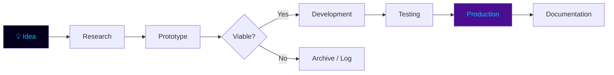

# PAI README — Complete Architecture Blueprint
# Personal Artificial Intelligence | ik-awais
# Design System · Layout · Animation · Component Templates

---

## ⚠️ CRITICAL: capsule-render.vercel.app IS BROKEN
> Never use `capsule-render.vercel.app`. Replace all header/footer animations with
> the animated gif divider + large typing SVG combo documented below.

---

## 1. COLOR SYSTEM

| Token         | Hex       | Usage                          |
|:------------- |:--------- |:------------------------------ |
| `--deep`      | `#03001e` | Primary bg, card fill          |
| `--dark`      | `#0b0630` | Secondary bg, section bg       |
| `--violet`    | `#4a0e8f` | Borders, ring, stroke          |
| `--purple`    | `#9d6fff` | Secondary text, badges, labels |
| `--cyan`      | `#00c8ff` | Primary accent, titles, links  |
| `--text`      | `#e8e8f0` | Body text                      |
| `--muted`     | `#a0a0b8` | Secondary text, captions       |
| `--green`     | `#00ff88` | Active/live status badges      |
| `--amber`     | `#ffaa00` | WIP / in-progress badges       |
| `--red`       | `#ff4466` | Archived / deprecated badges   |

---

## 2. TYPOGRAPHY HIERARCHY

| Level | Element           | Font          | Size | Color     |
|:------|:------------------|:------------- |:---- |:--------- |
| H0    | Animated header   | Fira Code     | 28px | `#00c8ff` |
| H1    | Section title     | `##` + gif icon | —  | `#00c8ff` |
| H2    | Sub-section       | `###`         | —    | `#9d6fff` |
| Body  | Prose             | GitHub MD     | —    | `#e8e8f0` |
| Code  | YAML/code blocks  | Fira Code     | 13px | `#00c8ff` |
| Badge | Shields.io        | —             | —    | per token |

---

## 3. ANIMATION BLUEPRINT

### 3A. ANIMATED DIVIDER (use everywhere between sections)
```

```
Rule: wrap in `<div align="center">...</div>`. Use after EVERY major section.

### 3B. HEADER TYPING SVG (replaces capsule-render header)
```
<!-- LINE 1: Repo title — large, slow, cyan -->


<!-- LINE 2: Role subtitle — medium, purple -->

```

### 3C. FOOTER TYPING SVG (replaces capsule-render footer)
```

```

### 3D. SECTION TICKER (used inside sections for stack)
```

```

### 3E. SKILL ICONS (skillicons.dev)
```
<!-- AI/ML -->


<!-- LLM Ecosystem — use img badges (skillicons has no langchain icon) -->


<!-- Infra -->


<!-- Databases -->

```

### 3F. GITHUB STATS
```html
<table>
  <tr>
    <td>
      
    </td>
    <td>
      
    </td>
  </tr>
  <tr>
    <td colspan="2" align="center">
      
    </td>
  </tr>
  <tr>
    <td colspan="2" align="center">
      
    </td>
  </tr>
</table>
```

---

## 4. BADGE CONVENTIONS

### Status Badges
| Status       | Badge template                                                                                        |
|:------------ |:----------------------------------------------------------------------------------------------------- |
| Active       | ``                    |
| In Progress  | ``                  |
| Prototype    | ``                  |
| Research     | ``                |
| Archived     | ``                |
| Planned      | `` |

### Complexity Badges
```


```

### Progress Bar (text-based, GitHub-safe)
```
Progress: ████████░░ 80%     → use Unicode blocks: █ = filled, ░ = empty
Scale: 10 blocks = 100%
Examples:
  ██████████ 100%  (complete)
  ████████░░  80%  (near complete)
  ██████░░░░  60%  (mid)
  ████░░░░░░  40%  (early)
  ██░░░░░░░░  20%  (started)
  ░░░░░░░░░░   0%  (planned)
```

---

## 5. SECTION HIERARCHY & LAYOUT

```
PAI/README.md
│
├── [S01] ANIMATED HEADER
│     ├── Gif divider
│     ├── Typing SVG — title (H0, cyan, large)
│     ├── Typing SVG — subtitle (medium, purple)
│     └── Gif divider
│
├── [S02] REPOSITORY INTRODUCTION
│     └── YAML code block (name, type, maintainer, scope, year)
│
├── [S03] VISION & MISSION
│     └── Blockquote + 2-column table (Vision | Mission)
│
├── [S04] REPOSITORY ARCHITECTURE OVERVIEW
│     └── Directory tree code block + table of directories
│
├── [S05] AI DOMAINS COVERED
│     └── Badge grid (one badge per domain, 4 per row)
│
├── [S06] CURRENT AI PROJECTS
│     └── Project cards table (see Section 6)
│
├── [S07] UPCOMING AI PROJECTS
│     └── Compact planned table (see Section 6)
│
├── [S08] AGENTIC AI ROADMAP
│     └── Numbered roadmap table (Phase | Goal | Status)
│
├── [S09] RESEARCH & EXPERIMENTATION ZONE
│     └── Collapsible <details> per research area
│
├── [S10] AI TECHNOLOGY STACK
│     └── Categorized skillicon rows + badge rows
│
├── [S11] LEARNING JOURNEY TIMELINE
│     └── Timeline table (Period | Milestone | Technologies)
│
├── [S12] FEATURED FLAGSHIP PROJECTS
│     └── Flagship card per project (full detail, see Section 6)
│
├── [S13] AI PROJECT CATEGORIES
│     └── Category index table (Category | Count | Projects)
│
├── [S14] REPOSITORY STATISTICS
│     └── GitHub stats table (3F template above)
│
├── [S15] DEVELOPMENT WORKFLOW
│     └── Mermaid flowchart (idea → prototype → production)
│
├── [S16] FUTURE EXPANSION PLANS
│     └── Collapsible <details> per expansion area
│
├── [S17] CONTRIBUTION GUIDELINES
│     └── Numbered steps + badge conventions reference
│
├── [S18] CONTACT & LINKS
│     └── Badge row (LinkedIn, Portfolio, Gmail, Work Mail)
│
└── [S19] ANIMATED FOOTER
      ├── Gif divider
      ├── Footer typing SVG
      └── Plain text links (portfolio · email)
```

---

## 6. PROJECT CARD TEMPLATES

### 6A. STANDARD PROJECT TABLE (default — up to ~15 projects)
Use this as the primary layout for [S06] and [S07].

```markdown
<div align="center">

| Project | Domain | Status | Stack | Progress | Links |
|:--------|:-------|:-------|:------|:---------|:------|
| [**PROJECT_NAME**](REPO_LINK) | `DOMAIN` | ![STATUS_BADGE] | `Tech1` `Tech2` `Tech3` | `████████░░ 80%` | [📄 Docs](DOCS_LINK) |

</div>
```

Column widths: Name(20%) Domain(12%) Status(12%) Stack(28%) Progress(18%) Links(10%)

### 6B. FLAGSHIP PROJECT CARD (for [S12] — 3–5 featured projects max)
```markdown
<div align="center">

### [PROJECT_NAME](REPO_LINK)

![STATUS_BADGE] ![COMPLEXITY_BADGE] ![DOMAIN_BADGE]

> _One-line description — what it does and why it matters._

| Attribute    | Detail                                    |
|:------------ |:----------------------------------------- |
| **Type**     | `Prototype` / `Research` / `Production`  |
| **Domain**   | Computer Vision / NLP / Agentic AI / etc |
| **Stack**    | `Tech1` · `Tech2` · `Tech3` · `Tech4`   |
| **Progress** | `████████░░ 80%`                         |
| **Docs**     | [Documentation](DOCS_LINK)               |

</div>
```

### 6C. PROTOTYPE PROJECT CARD
```markdown
| [**PROJECT_NAME**](REPO_LINK) | Prototype |  | `Tech1` `Tech2` | `████░░░░░░ 40%` | [📄](LINK) |
```

### 6D. EXPERIMENTAL PROJECT CARD
```markdown
| [**PROJECT_NAME**](REPO_LINK) | Experiment |  | `Tech1` `Tech2` | `██░░░░░░░░ 20%` | — |
```

### 6E. PRODUCTION PROJECT CARD
```markdown
| [**PROJECT_NAME**](REPO_LINK) | Production |  | `Tech1` `Tech2` | `██████████ 100%` | [📄](LINK) |
```

### 6F. ARCHIVED PROJECT CARD
```markdown
| [**PROJECT_NAME**](REPO_LINK) | Archived |  | `Tech1` `Tech2` | `████████░░ 80%` | [📄](LINK) |
```

### 6G. RESEARCH PROJECT CARD
```markdown
| [**PROJECT_NAME**](REPO_LINK) | Research |  | `Tech1` `Tech2` | `██████░░░░ 60%` | [📄](LINK) |
```

### 6H. PLANNED PROJECT ROW (for [S07])
```markdown
| **PROJECT_NAME** | `DOMAIN` |  | `Tech1` `Tech2` | `░░░░░░░░░░  0%` | — |
```

---

## 7. SCALABILITY PATTERNS

### 7A. Compact mode (≤15 projects): Use 6A standard table directly.

### 7B. Medium scale (16–30 projects): Group by domain using `<details>` collapse.
```markdown
<details>
<summary><b>🧠 NLP Projects (N)</b></summary>
<br>

| Project | Status | Stack | Progress | Links |
|:--------|:-------|:------|:---------|:------|
| ... project rows ... |

</details>
```

### 7C. Large scale (31–50+ projects): Two-level grouping.
- Top level: domain category headers (`##`)
- Second level: `<details>` per sub-domain or type
- Always show flagship table (S12) at full-detail regardless of total count

### 7D. Category Index (always present — [S13])
```markdown
| Category           | Projects | Sub-domains                              |
|:------------------ |:-------- |:---------------------------------------- |
| Agentic AI         | N        | Multi-Agent, Tool Use, Planning          |
| RAG Systems        | N        | Document QA, Semantic Search             |
| Computer Vision    | N        | Classification, Detection, Segmentation  |
| NLP                | N        | Sentiment, NER, Summarization            |
| LLM                | N        | Fine-tuning, Inference, Evaluation       |
| AI Utilities       | N        | Data pipelines, Loaders, Helpers         |
| Research           | N        | Paper implementations, experiments       |
```
Update only the `N` counts when adding projects.

---

## 8. SECTION TEMPLATES (verbatim-ready)

### [S01] ANIMATED HEADER
```markdown
<div align="center">


<br/>

[](https://www.linkedin.com/in/muhammad-awais-ai-engineer/)
[](https://ik-awais.github.io)
[](mailto:mawaisqq@gmail.com)

<br/>


</div>
```

### [S02] REPOSITORY INTRODUCTION
```markdown
##  Repository

```yaml
name:        PAI — Personal Artificial Intelligence
type:        AI Laboratory · Umbrella Repository
maintainer:  Muhammad Awais (ik-awais)
scope:       All AI projects, experiments, research, and prototypes
year:        2026 — present
domains:
  - Agentic AI & Multi-Agent Systems
  - RAG & LLM Systems
  - Computer Vision
  - NLP
  - AI Utilities & Infrastructure
portfolio:   https://ik-awais.github.io
```
```

### [S03] VISION & MISSION
```markdown
##  Vision & Mission

> *[INSERT QUOTE — one sentence that captures the PAI philosophy]*

<div align="center">

| 🔭 Vision | 🎯 Mission |
|:---------|:---------|
| [FILL — long-term aspiration for PAI] | [FILL — what PAI accomplishes day to day] |

</div>
```

### [S04] REPOSITORY ARCHITECTURE OVERVIEW
```markdown
## 📁 Repository Architecture

```
PAI/
├── [PROJECT_1]/          # [one-line description]
├── [PROJECT_2]/          # [one-line description]
├── [PROJECT_N]/          # [one-line description]
└── README.md
```

<div align="center">

| Directory | Type | Domain | Status |
|:--------- |:---- |:------ |:------ |
| `PROJECT_1/` | Production | Computer Vision | ![Active] |
| `PROJECT_2/` | Research | NLP | ![Research] |

</div>
```

### [S05] AI DOMAINS COVERED
```markdown
## 🧠 AI Domains Covered

<div align="center">


</div>
```

### [S08] AGENTIC AI ROADMAP
```markdown
## 🤖 Agentic AI Roadmap

<div align="center">

| Phase | Goal | Status |
|:------|:---- |:------ |
| Phase 1 | [FILL — first milestone] | ![Active] |
| Phase 2 | [FILL — second milestone] | ![Planned] |
| Phase 3 | [FILL — third milestone] | ![Planned] |

</div>
```

### [S09] RESEARCH & EXPERIMENTATION ZONE
```markdown
## 🔬 Research & Experimentation Zone

<details>
<summary><b>📄 Paper Implementations</b></summary>
<br>

| Paper | Domain | Year | Status |
|:------|:-------|:-----|:------ |
| [PAPER_TITLE](LINK) | NLP | 2024 | ![Research] |

</details>

<details>
<summary><b>⚗️ Active Experiments</b></summary>
<br>

| Experiment | Hypothesis | Status |
|:---------- |:---------- |:------ |
| [EXP_NAME] | [FILL] | ![WIP] |

</details>
```

### [S11] LEARNING JOURNEY TIMELINE
```markdown
## 📅 Learning Journey Timeline

<div align="center">

| Period | Milestone | Technologies |
|:------ |:--------- |:------------ |
| 2025 Q1 | [FILL] | `Tech1` `Tech2` |
| 2025 Q2 | [FILL] | `Tech1` `Tech2` |
| 2026 Q1 | [FILL] | `Tech1` `Tech2` |

</div>
```

### [S15] DEVELOPMENT WORKFLOW
```markdown
## ⚙️ Development Workflow


```

### [S19] ANIMATED FOOTER
```markdown
<div align="center">


<br/>

**[ik-awais.github.io](https://ik-awais.github.io)** &nbsp;·&nbsp; **[m.awais@aigenmat.com](mailto:m.awais@aigenmat.com)**

</div>
```

---

## 9. SECTION ICON GIF MAP

| Section | GIF URL |
|:--------|:--------|
| About / Intro | `https://media.giphy.com/media/QssGEmpkyEOhBCb7e1/giphy.gif` |
| Tech Stack | `https://media.giphy.com/media/iY8CRBdQXODJSCERIr/giphy.gif` |
| Projects | `https://media.giphy.com/media/WFZvB7VIXBgiz3oDXE/giphy.gif` |
| Stats | `https://media.giphy.com/media/W5eoZHPpUx9sapR0eu/giphy.gif` |
| Contribution | `https://media.giphy.com/media/qgQUggAC3Pfv687qPC/giphy.gif` |
| Research | Use 🔬 emoji (no gif needed) |
| Roadmap | Use 🤖 emoji |
| Timeline | Use 📅 emoji |
| Workflow | Use ⚙️ emoji |
| Contact | `https://media.giphy.com/media/hvRJCLFzcasrR4ia7z/giphy.gif` |

Size: always `width="25"` for inline section icons.

---

## 10. GLOBAL LAYOUT RULES

1. Every section preceded and followed by the animated gif divider.
2. All tables and images wrapped in `<div align="center">...</div>`.
3. Section headings: `##  Section Name`
4. Never use `capsule-render.vercel.app`.
5. Never use `---` as a divider — use the gif divider instead.
6. Code blocks inside sections use triple backtick with language tag.
7. Badge style: `style=flat-square` for inline, `style=for-the-badge` for header/footer/domain rows.
8. All project links open in the same tab (no `target="_blank"` — not supported in GitHub MD).
9. Mermaid flowcharts use section `[S15]` only — not inside tables.
10. `<details>` collapse used only for sections with potentially many items (S09, S16, S07 when >10 items).
11. Progress bars: Unicode block format, monospace, always in backticks.
12. Year references: always 2026.

---

## 11. QUICK-ADD CHECKLIST (when adding a new project)

- [ ] Add row to [S06] standard project table
- [ ] Add directory entry to [S04] architecture tree + table
- [ ] Update count in [S13] category index
- [ ] If flagship: add full card to [S12]
- [ ] Update [S07] planned table (remove if was planned, now current)
- [ ] Update [S14] stats (automatic via GitHub stats cards — no action needed)
```