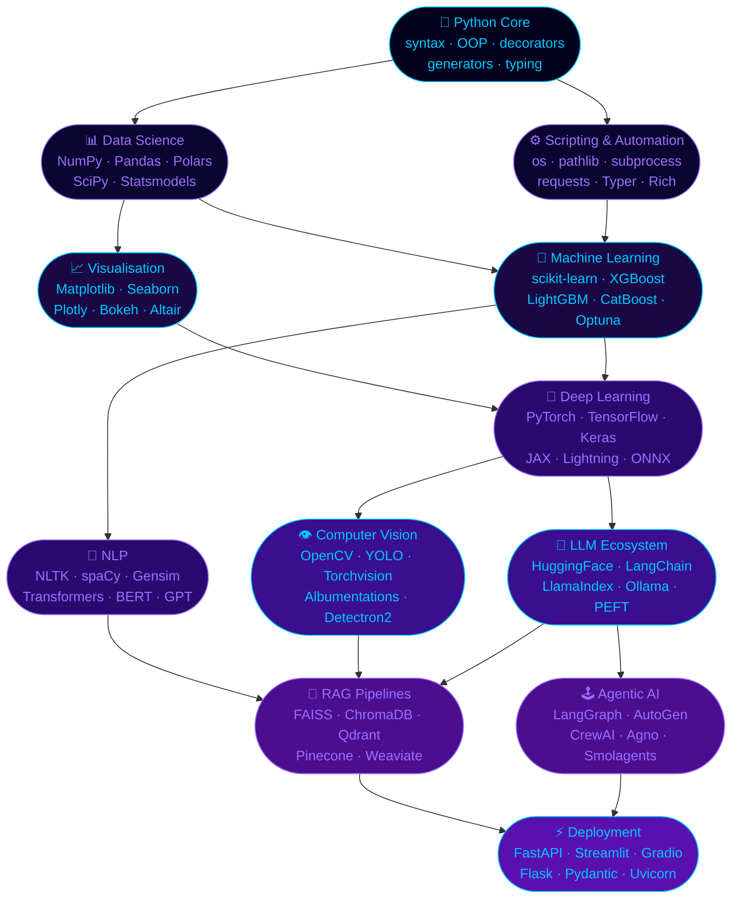

<!-- ╔══════════════════════════════════════════════════════════════════════╗ -->
<!-- ║   Muhammad Awais · Python Projects · Beginner → Agentic AI         ║ -->
<!-- ║   FAST-NUCES Peshawar · AI GenMat · ik-awais.github.io             ║ -->
<!-- ╚══════════════════════════════════════════════════════════════════════╝ -->

<!-- TICKER 1: journey -->

<!-- TICKER 2: stack pulse -->

 

<!-- INTERACTIVE QUICK-NAV BADGES -->

 

<!-- LIVE REPO STATS ROW -->

---

## `>>>` Repository at a Glance

| | |
|:--|:--|
| **Owner** | Muhammad Awais |
| **Role** | AI Engineer · Managing Director @ AI GenMat |
| **Education** | BS Artificial Intelligence — FAST-NUCES Peshawar |
| **Repo** | github.com/ik-awais/Python_Projects |

| Level | Scope |
|:------|:------|
| 🟢 Beginner | syntax, OOP, data structures, file I/O |
| 🟡 Intermediate | automation, data science, APIs, scripting |
| 🔴 Advanced | ML, DL, CV, NLP, transformers, diffusion |
| 🟣 Expert | LLMs, RAG, fine-tuning, agentic systems |

| Domain | Libraries |
|:-------|:----------|
| core | Python 3.x · OOP · decorators · generators |
| data | NumPy · Pandas · Polars · SciPy |
| ml | scikit-learn · XGBoost · LightGBM · CatBoost |
| dl | PyTorch · TensorFlow · Keras · JAX |
| cv | OpenCV · Pillow · Albumentations · YOLO |
| nlp | NLTK · spaCy · Gensim · TextBlob |
| llm | HuggingFace · LangChain · LlamaIndex · Ollama |
| agents | LangGraph · AutoGen · CrewAI · Agno |
| rag | FAISS · ChromaDB · Pinecone · Weaviate |
| serve | FastAPI · Flask · Streamlit · Gradio |
| data_eng | Airflow · Prefect · SQLAlchemy · Pydantic |
| viz | Matplotlib · Seaborn · Plotly · Bokeh |

> *"Every commit is a neuron. Every repo is a brain."*

---

## 🗂️ Folder Map  *(click any folder to jump)*

| Folder | Subfolders | Libraries / Notes |
|:-------|:-----------|:------------------|
| [**🟢 Beginner/**](https://github.com/ik-awais/Python_Projects/tree/main/Beginner) | 01_syntax_basics · 02_control_flow · 03_data_structures | Core Python fundamentals |
| | 04_functions_lambdas · 05_oop_classes · 06_file_io_os | OOP · closures · pathlib |
| | 07_error_handling · 08_iterators_generators · 09_decorators_closures · 10_mini_projects | Advanced core + projects |
| [**🔵 PAI/**](https://github.com/ik-awais/Python_Projects/tree/main/PAI) | 📊 data_science/ | NumPy · Pandas · Polars · SciPy |
| | 📈 visualization/ | Matplotlib · Seaborn · Plotly · Bokeh |
| | 🤖 machine_learning/ | scikit-learn · XGBoost · LightGBM |
| | 🧠 deep_learning/ | PyTorch · TensorFlow · Keras · JAX |
| | 👁️ computer_vision/ | OpenCV · YOLO · Pillow · Albumentations |
| | 💬 nlp/ | NLTK · spaCy · Gensim · TextBlob |
| | 🔗 llm_integration/ | HuggingFace · LangChain · LlamaIndex |
| | 📡 rag_pipelines/ | FAISS · ChromaDB · Pinecone · Weaviate |
| | 🕹️ agentic_ai/ | LangGraph · AutoGen · CrewAI · Agno |
| | ⚡ serving/ | FastAPI · Streamlit · Gradio · Flask |
| [**🛠️ Tools/Files\_Garage/**](https://github.com/ik-awais/Python_Projects/tree/main/Tools/Files_Garage) | automation_scripts · data_processing · utility_helpers | Scripts & helpers |

---

## 🐍 Full Python Tech Stack

> Every library, framework, and tool used across this repository — organised by domain.

### ⬡ Core Python

---

### 📊 Data Science & Numerical Computing

---

### 📈 Visualisation

---

### 🤖 Machine Learning

---

### 🧠 Deep Learning

---

### 👁️ Computer Vision

---

### 💬 NLP

---

### 🔗 LLM Ecosystem

---

### 📡 RAG & Vector Stores

---

### 🕹️ Agentic AI

---

### ⚡ Serving & APIs

---

### 🔬 Testing & Tooling

---

## 🗺️ Python Mastery Roadmap

---

## 🏗️ Domain Breakdown

<b>🟢 &nbsp; Beginner Python — click to expand</b>

 

| # | Topic | Key Concepts |
|:--|:------|:-------------|
| 01 | Syntax & Basics | variables, types, I/O, operators |
| 02 | Control Flow | if/elif/else, match-case, ternary |
| 03 | Data Structures | list, tuple, dict, set, frozenset |
| 04 | Functions & Lambdas | args, kwargs, closures, functools |
| 05 | OOP | classes, inheritance, dunder methods, dataclasses |
| 06 | File I/O & OS | open(), pathlib, os, shutil, json, csv |
| 07 | Error Handling | try/except, custom exceptions, context managers |
| 08 | Iterators & Generators | iter(), yield, generator expressions |
| 09 | Decorators & Closures | @wraps, @property, @classmethod, @staticmethod |
| 10 | Mini Projects | CLI tools, text games, automation scripts |

 

<b>📊 &nbsp; Data Science — click to expand</b>

 

| Library | Purpose | Key APIs |
|:--------|:--------|:---------|
| **NumPy** | N-dimensional arrays & math | ndarray, broadcasting, linalg, fft |
| **Pandas** | Tabular data manipulation | DataFrame, groupby, merge, resample |
| **Polars** | Fast DataFrame (Rust-backed) | LazyFrame, expressions, streaming |
| **SciPy** | Scientific computing | optimize, stats, signal, sparse |
| **Statsmodels** | Statistical modelling | OLS, ARIMA, GLM, hypothesis tests |
| **Matplotlib** | 2D/3D plotting | pyplot, axes, FuncAnimation |
| **Seaborn** | Statistical visualisation | heatmap, pairplot, FacetGrid |
| **Plotly** | Interactive charts | graph_objects, express, Dash |
| **Bokeh** | Web-ready plots | figure, ColumnDataSource, widgets |

 

<b>🤖 &nbsp; Machine Learning — click to expand</b>

 

| Library | Algorithms / Features |
|:--------|:----------------------|
| **scikit-learn** | LinearRegression, RandomForest, SVM, KMeans, Pipeline, GridSearchCV |
| **XGBoost** | gradient boosting, GPU support, SHAP integration |
| **LightGBM** | leaf-wise growth, categorical features, DART |
| **CatBoost** | ordered boosting, native categoricals, GPU |
| **Optuna** | TPE sampler, pruning, distributed HPO |
| **MLflow** | experiment tracking, model registry, serving |

 

<b>🧠 &nbsp; Deep Learning — click to expand</b>

 

| Framework | Highlights |
|:----------|:-----------|
| **PyTorch** | nn.Module, autograd, DataLoader, TorchScript, CUDA |
| **TensorFlow / Keras** | Sequential, Functional API, tf.data, SavedModel |
| **JAX** | jit, vmap, grad, pmap — functional DL |
| **PyTorch Lightning** | Trainer, LightningModule, callbacks, auto-logging |
| **ONNX** | cross-framework model export & runtime |

**Architectures covered:** CNNs · RNNs · LSTMs · Transformers · ViT · Diffusion · GANs

 

<b>👁️ &nbsp; Computer Vision — click to expand</b>

 

| Tool | Use Cases |
|:-----|:----------|
| **OpenCV** | image processing, video I/O, feature detection, homography |
| **Ultralytics YOLO** | object detection, instance segmentation, pose estimation |
| **Pillow** | image manipulation, format conversion, filters |
| **Albumentations** | GPU-accelerated augmentations for training pipelines |
| **Torchvision** | pretrained models (ResNet, ViT, EfficientNet), transforms |
| **Detectron2** | Mask R-CNN, Panoptic FPN, keypoint detection |

 

<b>💬 &nbsp; NLP — click to expand</b>

 

| Library | Capabilities |
|:--------|:-------------|
| **NLTK** | tokenisation, POS tagging, stemming, WordNet |
| **spaCy** | NER, dependency parsing, pipelines, custom components |
| **Gensim** | Word2Vec, Doc2Vec, FastText, LDA topic modelling |
| **TextBlob** | sentiment analysis, translation, correction |
| **HF Transformers** | BERT, GPT-2, T5, mT5, RoBERTa, DistilBERT |
| **Sentence-Transformers** | semantic similarity, bi-encoders, cross-encoders |

 

<b>🔗 &nbsp; LLM Ecosystem — click to expand</b>

 

| Tool | Role |
|:-----|:-----|
| **HuggingFace Hub** | model & dataset downloads, tokenizers, pipelines |
| **PEFT + LoRA** | parameter-efficient fine-tuning for large models |
| **TRL** | RLHF, SFT, DPO, PPO training loops |
| **BitsAndBytes** | 4-bit / 8-bit quantisation (QLoRA) |
| **LangChain** | chains, agents, memory, tool use, callbacks |
| **LlamaIndex** | ingestion pipelines, query engines, node parsers |
| **Ollama** | local LLM inference (Llama 3, Mistral, Gemma) |
| **OpenAI SDK** | GPT-4o, embeddings, function calling, vision |
| **Anthropic SDK** | Claude API, streaming, tool use |
| **Groq** | ultra-fast inference via LPU hardware |

 

<b>📡 &nbsp; RAG Pipelines — click to expand</b>

 

| Component | Tools Used |
|:----------|:-----------|
| **Embedding** | text-embedding-3-small, bge-m3, e5-mistral |
| **Vector Store** | FAISS · ChromaDB · Pinecone · Weaviate · Qdrant |
| **Retriever** | dense, sparse (BM25), hybrid, HyDE |
| **Reranker** | Cohere Rerank, cross-encoder, FlashRank |
| **Generator** | GPT-4o · Claude · Llama 3 · Mistral |
| **Orchestration** | LangChain LCEL · LlamaIndex pipeline |

 

<b>🕹️ &nbsp; Agentic AI — click to expand</b>

 

| Framework | Architecture |
|:----------|:-------------|
| **LangGraph** | stateful multi-agent graphs, human-in-the-loop |
| **AutoGen** | conversational multi-agent framework by Microsoft |
| **CrewAI** | role-based agent crews, task delegation |
| **Agno** | lightweight agentic framework, tool-use |
| **Smolagents** | HuggingFace minimal code agents |

**Patterns:** ReAct · Plan-and-Execute · Reflexion · Tool Use · Memory · Multi-Agent

 

---

## 📊 GitHub Stats

<table>
  <tr>
    <td>
      
    </td>
    <td>
      
    </td>
  </tr>
  <tr>
    <td colspan="2" align="center">
      
    </td>
  </tr>
  <tr>
    <td colspan="2" align="center">
      
    </td>
  </tr>
</table>

---

## 🐍 Contribution Snake

<picture>
  <source media="(prefers-color-scheme: dark)" srcset="https://raw.githubusercontent.com/ik-awais/ik-awais/output/github-contribution-grid-snake-dark.svg" />
  <source media="(prefers-color-scheme: light)" srcset="https://raw.githubusercontent.com/ik-awais/ik-awais/output/github-contribution-grid-snake.svg" />
  
</picture>

---

## 💡 Skill Proficiency

| Skill | Level | Progress |
|:------|:-----:|:---------|
| Python Core | Expert | `████████████████████` 100% |
| Data Science | Expert | `██████████████████░░` 90% |
| Machine Learning | Advanced | `████████████████░░░░` 80% |
| Computer Vision | Advanced | `████████████████░░░░` 80% |
| FastAPI / Serving | Advanced | `████████████████░░░░` 80% |
| Deep Learning | Advanced | `███████████████░░░░░` 75% |
| NLP | Advanced | `██████████████░░░░░░` 70% |
| LLM / Fine-tuning | Intermediate+ | `█████████████░░░░░░░` 65% |
| RAG Pipelines | Intermediate+ | `█████████████░░░░░░░` 65% |
| Agentic AI | Intermediate+ | `████████████░░░░░░░░` 60% |

 

 
<b><a href="https://ik-awais.github.io">ik-awais.github.io</a></b> &nbsp;·&nbsp; <b><a href="mailto:m.awais@aigenmat.com">m.awais@aigenmat.com</a></b>

<!-- ANIMATED FOOTER -->

